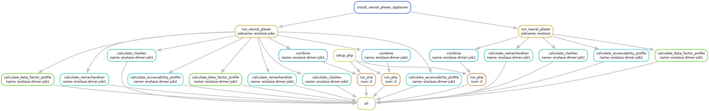

# NeuralPlexer workflow

Predicting the interaction between ligands and proteins with NeuralPlexer, a
deeplearning tool by [Qiao _et al._
2024](https://www.nature.com/articles/s42256-024-00792-z).

## Installation

The following commands install dependencies of the workflow in the _current_
directory within the `.pixi` folder. After installation, you cannot move the
folder without re-installling all the dependencies. 

```bash
curl -fsSL https://pixi.sh/install.sh | bash
# ... cd <this repo>
pixi install
```

## Usage

Each job has a directory in the `data/` folder:

```
data/
└── NATA1
    ├── NATA1.fa
    ├── NATA1.pdb
    ├── Structure2D_COMPOUND_CID_1045.sdf
    └── Structure2D_COMPOUND_CID_444493.sdf
```

Within each subdirectory of `data` must be at least 1 pdb and sdf file for
which the interaction is to be predicted.


* `pixi run make` runs the full workflow. You can supply arguments to `snakemake` as needed, such as `--cores 10`, if your process needs 10 cores.

* `pixi run test` runs a dry run (`-np`) of the workflow. 

* `pixi run update_dag` updates the directed acyclic graph of the snakemake workflow and moves it to the `resources` folder.

* `pixi run help` show the usage of the Snakefile

## About

When `pixi run make` is executed, the snakemake pipeline sets up neuralplexer
and predicts each listed complex in `data`.


